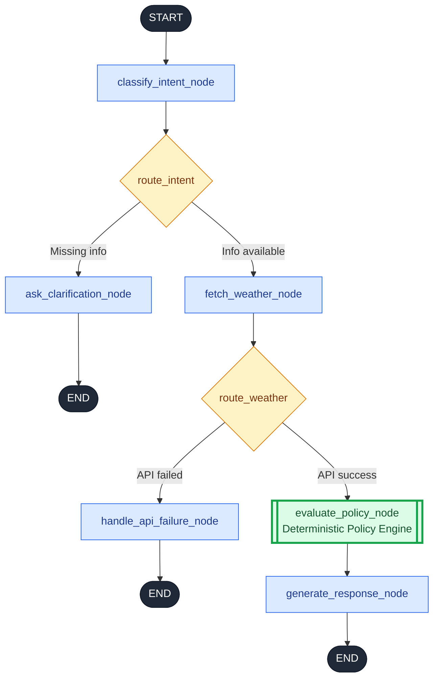

# 🌤️ Weather Safety Advisory Agent

A weather safety agent should not treat every outdoor activity the same way.

For example, a **moderate UV index may still be acceptable for someone travelling in an enclosed car, while the same condition can require additional precautions for someone walking outdoors**. Similarly, high wind can have very different implications for a cyclist, a two-wheeler rider, or someone travelling in a car.

This is the principle behind this implementation: **safety recommendations are determined by the combination of the user's activity, weather conditions, and relevant context — rather than by a single generic weather threshold.**

## 🧠 What Was Implemented

The system goes beyond a basic weather-to-recommendation mapping by introducing a structured **policy and SOP framework**:

* **`16 Core SOPs`**: Covering activity-specific, weather-specific, hazard, and vulnerability scenarios.
* **`Activity Classification`**: Activities are organized into **`Travel`**, **`Exercise`**, and **`Leisure`** groups, allowing different rules to apply to different types of outdoor activities.
* **`Vulnerability Modifiers`**: Supports **`children`**, **`elderly users`**, and **`pets`**, allowing the same environmental conditions to be evaluated differently based on context.
* **`Weather Metric Binning`**: Continuous weather data is converted into defined **`severity bands`** for **`temperature`**, **`wind speed`**, **`humidity`**, **`precipitation`**, and **`UV index`** before policy evaluation.
* **`Severity-Based Recommendations`**: The engine goes beyond a binary yes/no response with four levels: **`RECOMMEND`**, **`ALLOW_WITH_CAUTION`**, **`ALLOW_WITH_LIMIT`**, and **`DO_NOT_RECOMMEND`**.
* **`Multi-SOP Evaluation`**: Multiple applicable SOPs can be evaluated together, with the policy engine resolving which conditions and rules determine the final recommendation.
* **`Safe Fallbacks`**: Unsupported activity-condition combinations and insufficient weather data are handled explicitly instead of generating unsupported safety guidance.
* **`8-Case Evaluation Suite`**: Tests direct rule matching, fuzzy/multi-condition scenarios, hazard precedence, vulnerable groups, missing data, unsupported coverage, and adversarial inputs.

At the core of the implementation is a strict separation between **understanding the user's request** and **making the safety decision**:

```text
Natural Language
↓
Intent & Context
↓
Live Weather
↓
Deterministic SOP Evaluation
↓
Severity-Based Decision
↓
Natural Language Response

```
---
---
# 🚀 Tech Stack
* **Orchestration & State Management:** LangGraph, LangChain
* **Large Language Model (LLM):** Google Gemini (`gemini-3.8-flash`) via Gemini API
* **Weather Data Provider:** Open-Meteo API
* **Frontend Interface:** Streamlit
* **Architecture:** Python 3, Object-Oriented Policy Engine, YAML configuration files

# 🚀 Live Demo

[Open the Weather Safety Advisory Agent](https://shakshyamproject.streamlit.app/)

---
---

# 🧠 AI Agent Architecture

The agent is a **stateful LangGraph workflow** that separates **LLM-based intent understanding** from **deterministic safety evaluation**. **LangChain** connects the agent to Gemini for intent extraction and response generation, while **LangGraph** orchestrates the shared state, conditional routing, and conversation checkpoints.

The safety decision remains grounded in deterministic, version-controlled YAML SOPs rather than being generated by the LLM.

### Workflow Visualization




### Agent State

`AgentState` is the single shared object passed between nodes:

```text
messages 
city
activity
modifiers
weather
clarification_needed
api_failed
decision_summary
citations
```


### Node Responsibilities

- **`classify_intent_node`**: Uses Gemini via LangChain to extract `city`, `activity`, and `modifiers` (children, elderly, pets). Applies **Smart Merge** to preserve previously extracted information across turns.
- **`ask_clarification_node`**: Requests missing information (city or activity).
- **`fetch_weather_node`**: Retrieves live weather and stores it in `AgentState`.
- **`evaluate_policy_node`**: Runs the **deterministic policy engine** against weather, activity, modifiers, metric bands, and YAML SOPs. **No LLM is involved in this decision.**
- **`handle_api_failure_node`**: Returns a safe, controlled fallback when weather data is unavailable.
- **`generate_response_node`**: Converts the policy decision into natural language. The LLM must preserve the decision and must not invent additional safety rules.

### Framework Responsibilities

| Component | Role in This Project |
| --- | --- |
| **`LangChain`** | Gemini integration (`ChatGoogleGenerativeAI`), message types, intent extraction, response generation |
| **`LangGraph`** | `StateGraph` orchestration, `AgentState`, nodes, conditional edges, `START`/`END` |
| **`Policy Engine`** | Deterministic safety evaluation |
| **`YAML SOPs`** | Version-controlled rules, thresholds, and recommendations |
| **`Weather API`** | Live weather conditions |
| **`MemorySaver`** | Per-`thread_id` conversation checkpointing |

### Design Principle

```text
User Input → LangChain + Gemini → Intent & Context → LangGraph Workflow
→ Live Weather → Deterministic Policy Engine → Safety Decision
→ LangChain + Gemini → Natural Language Response
```

**The LLM interprets and communicates; the policy engine decides.**

---
---

# Weather & Activity Recommendation Engine

This engine evaluates real-time weather metrics against safety thresholds to generate actionable recommendations for outdoor activities. Rather than mapping infinite individual activities, the system categorizes intents and applies specific safety rules (SOPs) based on environmental conditions and vulnerable groups.

---

## 1. System Taxonomy & Activities

Activities are grouped into distinct categories to streamline rule application. 

| Category | Description | Supported Activities |
| :--- | :--- | :--- |
| **`Travel`** | Transportation and commuting | Car/Enclosed Vehicle (`driving`), Motorcycle/Scooter (`two_wheeler`), Walking Commute (`walking_commute`), Bicycle Commute (`cycling_commute`) |
| **`Exercise`** | Physical outdoor exertion | Recreational Cycling (`cycling`), Running/Jogging (`running`), Fitness Walking (`walking`), Team/Field Sports (`outdoor_sports`) |
| **`Leisure`** | Low-exertion tasks and subjective activities | Outdoor Picnic (`picnic`), Patio/Outdoor Dining (`outdoor_dining`), Dog Walking (`dog_walking`), Drying Laundry (`laundry`) |

### Context Modifiers (Vulnerable Groups)
The system evaluates specific vulnerability markers that deterministically tighten permissible safety thresholds:
* **`Children` (`children`):** Infants and children.
* **`Elderly` (`elderly`):** Seniors and older adults.
* **`Pets `(`pets`):** Domestic pets.

---

## 2. Metric Binning (Thresholds)

Raw continuous weather variables are processed through a `bin_metrics()` layer mapping floating-point data to deterministic safety bands. 

<table width="100%">
<tr>
<td valign="top" width="33%" colspan="2">

<h3 align="center">🌡️ Temperature (°C)</h3>

| Level | Range |
| :--- | :--- |
| 🟣 **VERY_COLD** | < 5.0 |
| 🔵 **COLD** | 5.0 to 15.9 |
| 🟢 **COMFORTABLE** | 16.0 to 27.9 |
| 🟠 **HOT** | 28.0 to 37.9 |
| 🔴 **EXTREME_HEAT** | ≥ 38.0 |

</td>
<td valign="top" width="33%" colspan="2">

<h3 align="center">💨 Wind Speed (km/h)</h3>

| Level | Range |
| :--- | :--- |
| 🟢 **LIGHT** | 0.0 to 19.9 |
| 🟡 **MODERATE** | 20.0 to 39.9 |
| 🟠 **STRONG** | 40.0 to 59.9 |
| 🔴 **EXTREME** | ≥ 60.0 |

</td>
<td valign="top" width="33%" colspan="2">

<h3 align="center">💧 Humidity (%)</h3>

| Level | Range |
| :--- | :--- |
| 🟤 **DRY** | 0.0 to 34.9 |
| 🟢 **COMFORTABLE** | 35.0 to 69.9 |
| 🟡 **MUGGY** | 70.0 to 84.9 |
| 🔴 **OPPRESSIVE** | ≥ 85.0 |

</td>
</tr>
<tr>
<td valign="top" width="50%" colspan="3">

<h3 align="center">🌧️ Precipitation (mm)</h3>

| Level | Range |
| :--- | :--- |
| ⚪ **NONE** | 0.0 |
| 🔵 **LIGHT** | 0.1 to 2.4 |
| 🟡 **MODERATE** | 2.5 to 7.4 |
| 🟠 **HEAVY** | 7.5 to 29.9 |
| 🔴 **EXTREME** | ≥ 30.0 |

</td>
<td valign="top" width="50%" colspan="3">

<h3 align="center">☀️ UV Index</h3>

| Level | Range |
| :--- | :--- |
| 🟢 **LOW** | 0.0 to 2.9 |
| 🟡 **MODERATE** | 3.0 to 5.9 |
| 🟠 **HIGH** | 6.0 to 7.9 |
| 🔴 **VERY_HIGH** | 8.0 to 10.9 |
| 🟣 **EXTREME** | ≥ 11.0 |

</td>
</tr>
</table>

---

## 3. System Flags & Severity Levels

### Weather Flags
* **`thunderstorm_active`**: Active convective storm or lightning alert.
* **`regional_rain_system`**: Synoptic low-pressure system or depression flagged by the meteorological bureau.

### Severity Order (Lowest to Highest Risk)
1. `RECOMMEND`
2. `ALLOW_WITH_CAUTION`
3. `ALLOW_WITH_LIMIT`
4. `DO_NOT_RECOMMEND`

---
---
# 4. Standard Operating Procedures (SOPs)

The engine evaluates conditions against 16 foundational Standard Operating Procedures across diverse activities and vulnerable groups, falling back to 3 baseline conditions when specific rules do not trigger.

### `The 16 Core Rules`
1. **`Moderate Wind Cycling:`** Energy preservation and resistance planning against headwinds.
2. **`High Wind Cycling:`** Control hazards and instability risks for bicycles on traffic routes.
3. **`Elevated Heat Running:`** Thermal strain management and volume reduction for intense cardio.
4. **`Extreme Heat Running:`** Severe heatstroke risks halting intense outdoor cardio.
5. **`High UV Radiation:`** Sun protection requirements, SPF usage, and shade seeking.
6. **`Regional Rain Systems:`** Synoptic override for well-marked low-pressure systems and intense rainfall.
7. **`Severe Thunderstorms & Lightning:`** Immediate synoptic override requiring substantial indoor shelter.
8. **`Muggy Leisure Conditions:`** Fuzzy logic for high humidity, low wind, and elevated mosquito activity.
9. **`Chilly Dining Conditions:`** Fuzzy logic for wind chill discomfort during seated outdoor activities.
10. **`Two-Wheeler Rain Hazards:`** Acute skidding risks and severe visibility reduction for bikes/scooters.
11. **`Two-Wheeler Wind Hazards:`** Crosswind balance and stability threats halting two-wheeler transit.
12. **`Driving Wind Cautions:`** Steering handling and speed reduction requirements for cars on open routes.
13. **`Walking Commute Heat:`** Pacing, shade, and hydration protocols for high heat exposure.
14. **`Child UV Vulnerability:`** Accelerated skin burn risks and strict direct sun exposure limits for children.
15. **`Elderly Heat Vulnerability:`** Impaired heat dissipation risks halting outdoor exertion for older adults.
16. **`Pet Heat Vulnerability:`** Radiant heat and pavement burn risks limiting dog walking surfaces and duration.

### Baseline SOPs (System Defaults)
* **`BASE-CLEAR`**: Conditions are fully evaluated and clear for this activity. Follow standard everyday precautions.
* **`BASE-NO-COVERAGE`**: We currently do not have specific safety guidance for this activity or condition combination.
* **`BASE-INSUFFICIENT-DATA`**: Unable to retrieve reliable weather data for this location. We cannot make a safety recommendation.
---
---

# 5. Evaluation & Test Suite

The engine includes a robust test suite (`eval.py`) covering **8 core test cases** to prove deterministic execution, edge-case safety, and vulnerability management.

Run the test harness via terminal:
```bash
python eval.py

```markdown
## 5. Evaluation & Test Suite

The engine includes a robust test suite (`eval.py`) covering **8 core test cases** to prove deterministic execution, edge-case safety, and vulnerability management.

Run the test harness via terminal:
```bash
python eval.py

```

### Test Suite Overview

| #     | Test Scenario                              | Expected Outcome / SOP                           | Architectural Guarantee                                                                                                                                        |
| ----- | ------------------------------------------ | ------------------------------------------------ | -------------------------------------------------------------------------------------------------------------------------------------------------------------- |
| **1** | Two-wheeler in rain                        | `TRAV-2W-RAIN-01` (Do Not Recommend)             | **Exact Match:** Fires precise environmental rules.                                                                                                            |
| **2** | Muggy outdoor picnic                       | `FUZZY-PICNIC-MUGGY-01` (Caution)                | **Composite Logic:** Handles multi-metric comfort conditions.                                                                                                  |
| **3** | Regional rain system                       | `HAZ-REGIONAL-SYSTEM-01` (Lead Rule)             | **Synoptic Precedence:** Macro hazards take precedence over activity-specific rules.                                                                           |
| **4** | Uncovered activity                         | `BASE-NO-COVERAGE`                               | **Honest Fallback:** Avoids inventing unsupported guidance.                                                                                                    |
| **5** | Missing weather data                       | `BASE-INSUFFICIENT-DATA`                         | **Fail-Safe:** Handles incomplete weather data without making a safety decision.                                                                               |
| **6** | Paraphrased intents + adversarial override | Deterministic policy decision remains unchanged  | **Engine Integrity:** Natural-language variations are separated from deterministic policy evaluation, preventing prompt injection from bypassing safety rules. |
| **7** | Elderly walking in heat                    | `VULN-ELDERLY-HEAT-01` (Do Not Recommend)        | **Dynamic Adaptation:** Applies stricter safety rules for vulnerable users.                                                                                    |
| **8** | Dog walking with pets                      | `VULN-PET-HEAT-01` (Allow with Limit)            | **Granular Binding:** Enforces activity- and modifier-specific safety rules.                                                                                   |
| **9** | Live weather API grounding                 | Decision and SOP citation based on live API data | **Live Data Grounding:** Evaluates real weather values without hardcoding or fabricating severe conditions.                                                    |

---

## 6. Conclusion

This Weather Safety Advisory Agent demonstrates a production-grade pattern for building reliable AI applications: **decoupling deterministic safety guardrails from probabilistic language models**. By separating strict policy evaluation, binning layers, and vulnerability modifiers from the natural language communication layer, the system ensures that safety-critical decisions are always predictable, auditable, and immune to prompt manipulation.

---
---

### 👨‍💻 Author

**Shakshyam Pandey**  
* B.Tech in Information Technology (Final Year)  
* Indian Institute of Information Technology (IIIT) Bhopal  
* [GitHub](https://github.com/SHAKSHYAM23) | [LinkedIn](https://www.linkedin.com/in/shakshyam)